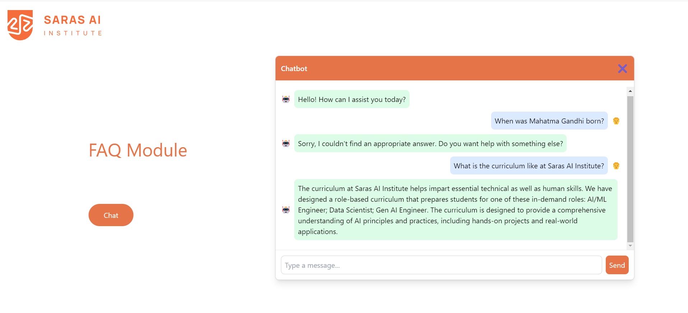

# Smart Querying for PDFs

## Introduction

This application provides a interface for querying FAQ smartly. The questions from a json file are embedded using the sentence-transformers/all-mpnet-base-v2 model and stored in a FAISS vector database for efficient similarity searches. Users can input FAQs related to the SARAS AI Institute and the chatbot delivers precise answers for relevant questions.

### Question Answering

1.	**Capturing the User’s Question:**
When the user submits a question, it is first checked to ensure that the question is provided and that the knowledge base is initialized. If these conditions are met, the question is added to the chat history.
2.	**Processing the Query:**
A loading spinner indicates that the system is processing the request. The user’s question is used to search the knowledge base for relevant answers. The knowledge base contains embeddings of questions extracted from a json file, enabling quick similarity searches.
3.	**Finding Relevant Answers:** 
The system retrieves the top question from the knowledge base that is most similar to the user’s question using L2 distance. The corresponding answer to that question is delivered and displayed to the yser.

$$
d(P, Q) = \sqrt{\sum_{i=1}^{n} (q_i - p_i)^2}
$$

Where P and Q are two n dimensional vector.

4.	**Updating the Chat History:**
The generated question-answer pair is added to the chat history, reflecting the interaction between the user’s question and the system’s response. This allows users to see the conversation flow.
5.	**Displaying the Conversation:**
The chat history is displayed with a clear distinction between user messages and bot responses. User messages are aligned to the right, and bot responses are aligned to the left, ensuring a readable and organized conversation.

### Threshold-based Similarity Filtering
1. When a user asks a question, the system searches through the stored knowledge for questions that are similar to the question asked by the user. The similarity_search_with_score function not only retrieves the question but also provides a similarity score for it. This score represents how closely the question matches the user’s question.

2. In this process, the system loops through the retrieved question and checks its score against a pre-defined threshold . If the question's score meets this threshold, it’s considered relevant and added to the question variable. If none of the questions have scores below the threshold, the system concludes that there’s “No match” for the query.

## Setup

1. Clone the respository 
```
git clone https://github.com/noddy-69/FAQ_Module.git
```
2. Enter into the repo directory
```
cd FAQ_Module
```
3. Create a virtual environment
```
python -m venv chat
```
4. Activate the envirnment for Windows
```
.\chat\Scripts\activate
```
5. Activate the envirnment for Mac
```
source chat/bin/activate
```
6. Install all the required libraries.
```
pip install -r requirements.txt
```

7. Run the flask app.
```
python app.py 
```
or
```
python3 app.py 
```
8. After running the app, it might take few seconds to generate the embeddings for the questions. Following this the embeddings will be stored in the vectore store and it would not require you to generate vectors for questions in json file for the current session again and again. Then click on chat, type the question in the input field and click send.

9. Upload the pdf file and ask your question.


   
   
## Resources 
```sentence-transformers/all-mpnet-base-v2``` - <a href="https://huggingface.co/sentence-transformers/all-mpnet-base-v2">Hugging Face<a/>