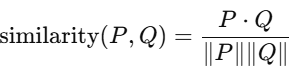

# FAQ Module

## Introduction

This application enables intelligent querying of FAQs using state-of-the-art semantic search techniques. It utilizes the sentence-transformers/all-mpnet-base-v2 model to embed questions from a JSON file and stores them in-memory for fast semantic similarity lookup.

The chatbot is capable of answering user queries related to the SARAS AI Institute by finding the most semantically similar question from the knowledge base and returning the corresponding answer.

### Question Answering

1.	**Capturing the User’s Query:**
When a user inputs a question:
- It is first validated (non-empty, relevant).
- Then it's appended to the chat history on the UI.

2.	**Processing and Embedding:**
- The user query is embedded using a locally loaded SentenceTransformer model.
- Embeddings of all FAQs are precomputed on app startup using sentence-transformers/all-mpnet-base-v2.

3.	**Semantic Matching:** 
- Cosine Similarity is used to match the query against stored FAQ embeddings:



- The question with the highest similarity score is selected.
- If the score exceeds a defined threshold (e.g., 0.75), the matched answer is returned. Otherwise, the system notifies the user that no relevant match was found.

4.	**Displaying the Response:**
- Bot and user messages are clearly styled.

- User messages are right-aligned, while bot responses are left-aligned.

- A typing spinner indicates processing.

## Setup

1. Clone the respository 
```
git clone https://github.com/noddy-69/FAQ_Module.git
```
2. Enter into the repo directory
```
cd FAQ_Module
```
3. Create a virtual environment
```
python -m venv chat
```
4. Activate the envirnment for Windows
```
.\chat\Scripts\activate
```
5. Activate the envirnment for Mac
```
source chat/bin/activate
```
6. Install all the required libraries.
```
pip install -r requirements.txt
```

7. Run the flask app.
```
python app.py 
```
or
```
python3 app.py 
```
## Using the Chatbot
- After launching the app, wait a few seconds for the embeddings to be generated.
- Visit http://127.0.0.1:5000/ in your browser.
- Click the Chat button at the bottom left.
- Ask your question and receive an accurate answer if it's semantically similar to one in the FAQ base.

   
   
## Resources 
```sentence-transformers/all-mpnet-base-v2``` - <a href="https://huggingface.co/sentence-transformers/all-mpnet-base-v2">Hugging Face<a/>
